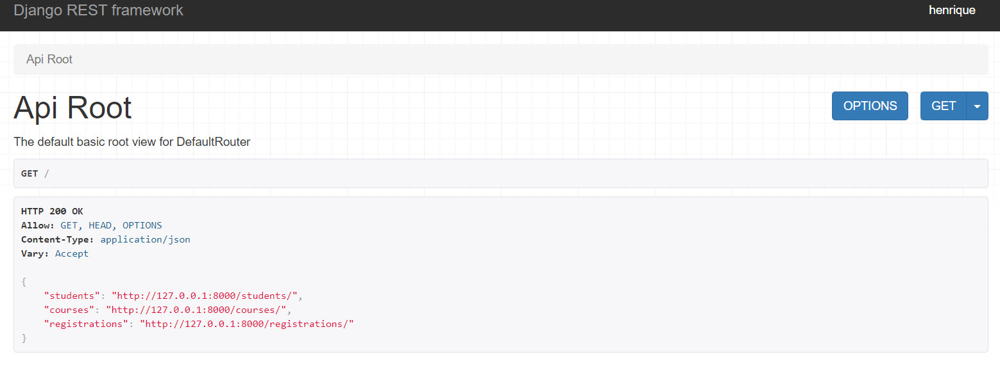

# django-rest-framework
Repository created for the "API com Django 3: Django Rest Framework" course in Alura.

# How to use

Clone the repository
```bash
git clone https://github.com/bonetou/django-rest-framework
```
Install requirements
```bash
python -m pip install -r requirements.txt
```
Run the server
```bash
python manage.py runserver
```
Access localhost:8000 on your browser:

